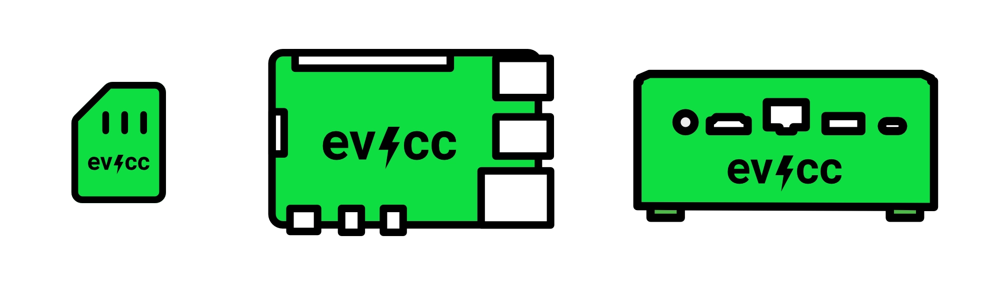

# evcc Linux Images for Raspberry Pi and other SBCs

[](https://depot.dev/?utm_source=evcc)

**✨ This is the recommended way for beginners to install evcc.**

Repository for ready-to-use [evcc](https://evcc.io) linux images for popular single-board computers like Raspberry Pi and NanoPi.

## Image contents

- ☀️🚗 [evcc](https://evcc.io) for smart energy management (stable version)
- 🔒 Secure by default with HTTPS ([Caddy](https://caddyserver.com))
- 📶 WiFi setup hotspot (via [comitup](https://github.com/davesteele/comitup)), optional
- 🛠️ System management UI ([Cockpit](https://cockpit-project.org))
  - Terminal
  - Package updates
  - Network configuration
  - User management
  - System logs
- 🛡️ Automatic security updates (Debian patches, checked daily)
- 🐧 Based on [Armbian](https://www.armbian.com)

## Getting Started

1. Download your image file from [releases](https://github.com/evcc-io/images/releases).
2. Flash your image to an SD card using [balenaEtcher](https://www.balena.io/etcher/) or [USBImager](https://gitlab.com/bztsrc/usbimager).
3. Insert your SD card and connect your device with power and ethernet.
4. Navigate to [`https://evcc.local/`](https://evcc.local/) in your browser. Accept the self-signed certificate.
5. You should see the evcc web interface.
6. Alternatively: Use the [evcc iOS/Android app](http://github.com/evcc-io/app) to connect to your evcc instance.

For more detailed instructions, see the [full documentation](https://docs.evcc.io/docs/installation/linux-image).

## Supported Boards

| Name                                                                                      | Tested | WiFi     | Storage   | Image Name                                                 | Instructions                                                                                      |
| ----------------------------------------------------------------------------------------- | ------ | -------- | --------- | ---------------------------------------------------------- | ------------------------------------------------------------------------------------------------- |
| [Raspberry Pi 5](https://www.raspberrypi.com/products/raspberry-pi-5/)                    | ✅     | Built-in | SD only   | [`rpi4b`](https://github.com/evcc-io/images/releases)      | see above                                                                                         |
| [Raspberry Pi 4](https://www.raspberrypi.com/products/raspberry-pi-4-model-b/)            | ✅     | Built-in | SD only   | [`rpi4b`](https://github.com/evcc-io/images/releases)      | see above                                                                                         |
| [Raspberry Pi 3b](https://www.raspberrypi.com/products/raspberry-pi-3-model-b/)           | ✅     | Built-in | SD only   | [`rpi4b`](https://github.com/evcc-io/images/releases)      | see above                                                                                         |
| [Raspberry Pi Zero 2 W](https://www.raspberrypi.com/products/raspberry-pi-zero-2-w/)      | ✅     | Built-in | SD only   | [`rpi4b`](https://github.com/evcc-io/images/releases)      | see above                                                                                         |
| [NanoPi R3S](https://www.friendlyelec.com/index.php?route=product/product&product_id=311) | ✅     | via USB  | eMMC & SD | [`nanopi-r3s`](https://github.com/evcc-io/images/releases) | see above, [then copy to eMMC](https://docs.armbian.com/User-Guide_Getting-Started/#installation) |

✅ tested<br/>
⚠️ untested (but should work)

## FAQ

### How do I access system administration?

Login to the Cockpit web console on [`https://evcc.local:9090/`](https://evcc.local:9090/)

- username `admin`
- password `admin`

You'll be prompted to change your password. **Remember the new password.** There is no reset.

You can see system health, update packages and run terminal commands.

Alternatively: connect via SSH `ssh admin@evcc.local`

### How do I update evcc?

Login to Cockpit ([`https://evcc.local:9090/`](https://evcc.local:9090/)) and click on **Software updates** in the left navigation.
Update evcc (and other packages) as needed.

### How do I run evcc nightly builds?

The image uses the stable evcc version by default.
To switch to nightly builds, login to Cockpit ([`https://evcc.local:9090/`](https://evcc.local:9090/)), click on **Terminal** in the left navigation, and run these commands:

```bash
# Add the nightly repository
curl -1sLf 'https://dl.evcc.io/public/evcc/unstable/setup.deb.sh' | sudo -E bash

# Update and upgrade to nightly
sudo apt update
sudo apt upgrade -y
```

To switch back to stable:

```bash
# Remove nightly repository
sudo rm /etc/apt/sources.list.d/evcc-unstable.list

# Reinstall stable version
sudo apt update
sudo apt install --reinstall evcc
```

For more details, see the [Linux installation documentation](https://docs.evcc.io/docs/installation/linux).

## Hardware Recommendations

### Storage

16GB storage should be enough when only using evcc.
We recommend running your system from eMMC instead of SD card.
**NanoPi boards come with built-in eMMC storage.**
If you decide to run your system directly from SD card, be sure to read [Armbian's recommendations](https://docs.armbian.com/User-Guide_Getting-Started/#armbian-getting-started-guide) first.

### CPU and RAM

All above boards have plenty of CPU and RAM for evcc.
1GB RAM should be enough.
Pick 2GB if you want to be on the safe side.

## Network Recommendations

For reliability we **strongly suggest** using a **wired ethernet connection**.

### Wireless Setup

If a wired setup is not possible this image also includes a wireless onboarding process.
The device will create a WiFi setup hotspot **if no internet connection is detected after 30 seconds of boot**.

1. Power your device
2. Connect to `evcc-setup` network from your phone or laptop
3. Select your WiFi network and enter the password
4. Connect back to your home network
5. Continue with step 4 from [Getting Started](#getting-started)

**Note**: WiFi setup is a one-time process. To reconfigure WiFi at a new location, simply reboot the device and `evcc-setup` will appear again.

For ethernet-only boards like the NanoPi, you can use WiFi USB dongles. The following adapters have been tested successfully:

- EDUP EP-B8508GS
- _add your's here ..._

## Hardware Comparison

CPU performance is not critical for evcc operation as it's not CPU-intensive. These benchmarks are provided for reference and future-proofing considerations.

',borderWidth:0},{label:'CPU%20Multi',data:[83.41,783.68,1466.78,2330.16,4165.05],backgroundColor:'rgba(255,99,132,0.8)',borderWidth:0}]},options:{responsive:false,maintainAspectRatio:false,plugins:{title:{display:false},legend:{display:true,position:'bottom',labels:{boxWidth:12,padding:8,font:{size:10}}}},scales:{x:{beginAtZero:true,grid:{display:false},ticks:{display:false}},y:{grid:{display:false},ticks:{font:{size:10}}}}}}>)

Benchmark methodology: Results obtained using sysbench with the following commands:

```bash
# CPU Single
sysbench --test=cpu --cpu-max-prime=20000 --num-threads=1 --max-time=200 run
# CPU Multi
sysbench --test=cpu --cpu-max-prime=20000 --num-threads=4 --max-time=200 run
```

## Building Images Locally

You'll need Docker Desktop installed and running.

```bash
# Clone and enter the repository
git clone https://github.com/evcc-io/images.git
cd images

# Build for Raspberry Pi
./build-local.sh --board rpi4b
```

The image will be at `dist/armbian_evcc-local_rpi4b.img.zip`.

## Contributing

- [Report issues](https://github.com/evcc-io/images/issues)
- [Submit pull requests](https://github.com/evcc-io/images/pulls)

## License

- [MIT](LICENSE)

## Thanks 💚

Huge thanks to the [Armbian](https://www.armbian.com) project for making building these images easy!
They also accept [donations](https://www.armbian.com/donate/). Wink wink.
